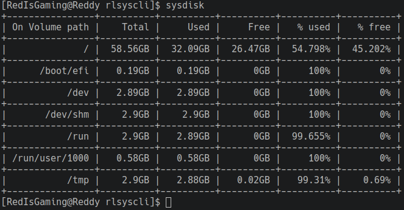

# rlsyscli
A functional CLI to show your system info. This application is written in C# and Shell.<br/> 
A utility tool to show your disk usage as well as your CPU/RAM and process usage.<br/>

## Author
> RedIsGaming

## License
> Apache-2.0 license

## How to use this project?
You can clone this project anywhere on your PC. 
To make this project work, follow the steps below: <br/>
```shell
# Step 1
git clone https://github.com/RedIsGaming/rlsyscli.git
OR
git clone git@github.com:RedIsGaming/rlsyscli.git

# This step only works from where rlsyscli is cloned to.
# Step 2
cd rlsyscli

<<mlc The following step works only in the current shell/prompt/console/terminal.
The location doesn't really matter though.
mlc

# Step 3 (Linux)
source "path/rlsyscli/disk.sh" # Where path is the location of your directory
# Example source "$HOME/Desktop/projects/rlsyscli/disk.sh"

#Step 3 (Windows)

#Example

# Step 4
sysdisk
```

## Sysdisk


## Status
> On going

## Tasks
- [x] Disk display Linux/Windows.
- [ ] CPU/RAM usage display.
- [ ] Process usage display.

## Contact
> Want to help or want to message me?
> Shoot a message in Discord: `redisgaming` for contact.
